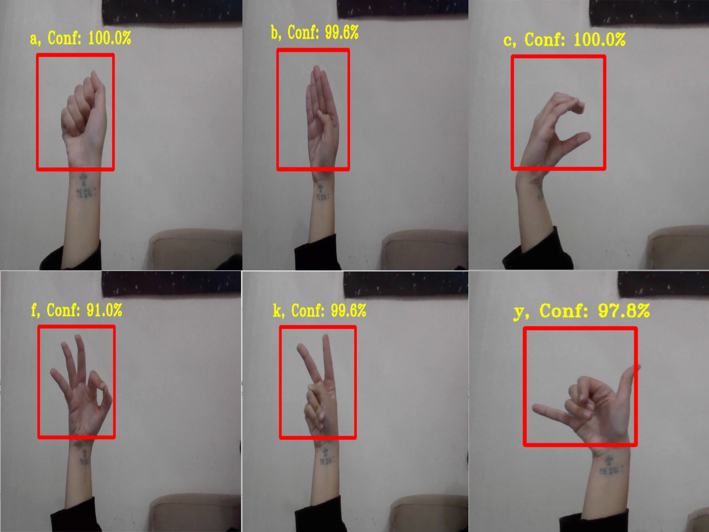

# CNN Hand Gesture Recognition

This project implements a Convolutional Neural Network (CNN) for hand gesture recognition using TensorFlow and OpenCV. The CNN is trained on a dataset containing hand gesture images labeled with corresponding letters. The trained model is then utilized for real-time hand gesture recognition through a webcam.

## Example Detection




## Table of Contents

- [Installation](#installation)
- [Usage](#usage)
- [Dataset](#dataset)

## Installation

1. Clone the repository:

```
git clone https://github.com/Sousannah/hand-gestures-recognition-using-cnn
```

2. Install the required dependencies:

```
pip install -r requirements.txt
```

## Usage

### Training the Model

To train the CNN model, run the `cnn_train_model01.py` script. This script loads hand gesture images from a specified directory, preprocesses the data, splits it into training, validation, and test sets, builds and trains the CNN model, and saves the trained model.

```
python cnn_train_model01.py
```

### Real-Time Detection

There are two scripts available for real-time hand gesture detection:

1. `real_time_detection.py`: This script performs real-time hand gesture recognition using the trained CNN model and displays the recognized gestures along with confidence scores on the screen.

```
python real_time_detection.py
```

2. `real_time_detection_with_sound.py`: Similar to the previous script, but this one also utilizes text-to-speech functionality to announce the recognized gestures audibly.

```
python real_time_detection_with_sound.py
```

## Dataset

-The dataset used in this project is sourced from Kaggle. You can download it from [here](https://www.kaggle.com/datasets/grassknoted/asl-alphabet).
-I have only used 'A', 'B', 'C', 'F', 'K', 'Y' Classes for training

